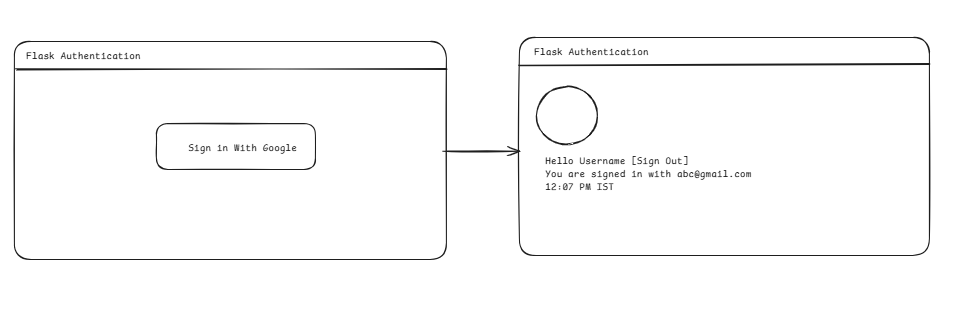

## Python Challenge
This repository contains a Flask authentication application. Flask is a lightweight web framework for python.

## About
The first task is to create a Authentication site to authenticate using our google account(gmail). It will use Google OAuth Authentication Process. OAuth is used to implement social login, which is a form of SSO using existing information from Sites like Facebook or Google, to sign in to a third-party website instead of creating a new login specifically for the site. 

## Rough Representation of the Application

## Process

OAuth stands for Open Authorization and was implemented to achieve a connection between online Services. IN this case we are establishing a service between google and our local flask application. The following steps are taken:
1. Registering a third-party application(Local Flask App) as a client to the Provider(Google OAuth Services). We receive unique client credentials from the provider that will be later used for authentication.

2. The client(Local Flask App) sends a request to the provider's(Google) authorization URL. 
3. The Provider(Google) asks the user(User who using the local Flask App to login) to authenticate (prove) and the provider (Google) asks the user to consent to the client(Local Flask App) acting on their behalf to provide limited access.
4. The provider(Google) sends the client(Local Flask App) a unique authorization code.
5. The client(Local Flask App) sends the authorization code back to the Provider's(Google) token URL.
6. The provider(Google) sends the client(Flask) tokens to use with other provider URLs on behalf of user. 

## Project Structure and Installation
The project is inside the folder named `Project` and contains two subfolders static(contains the style) and templates(Jinja2.0 templates that contains the HTML pages for UI). The project contains the `app.py` file that contains the routes and oauth configuration of the project. 
To execute this project, follow the below steps
- You can create Virtual Environment in Windows by suing the following commands: 
Follow the below steps in Windows 
`python -m venv .venv` 
To activate the Python Environment in Powershell Terminal `.venv\Scripts\Activate.ps1`
- To install the necessary libraries in the project `python -m pip install -r requirements.txt`
- Run `python app.py` and open the localhost link.

## Resources
1. RealPython
2. Stack Overflow
3. Appwrite Google Authentical Tutorial from Youtube
4. OpenAI
5. GFG

